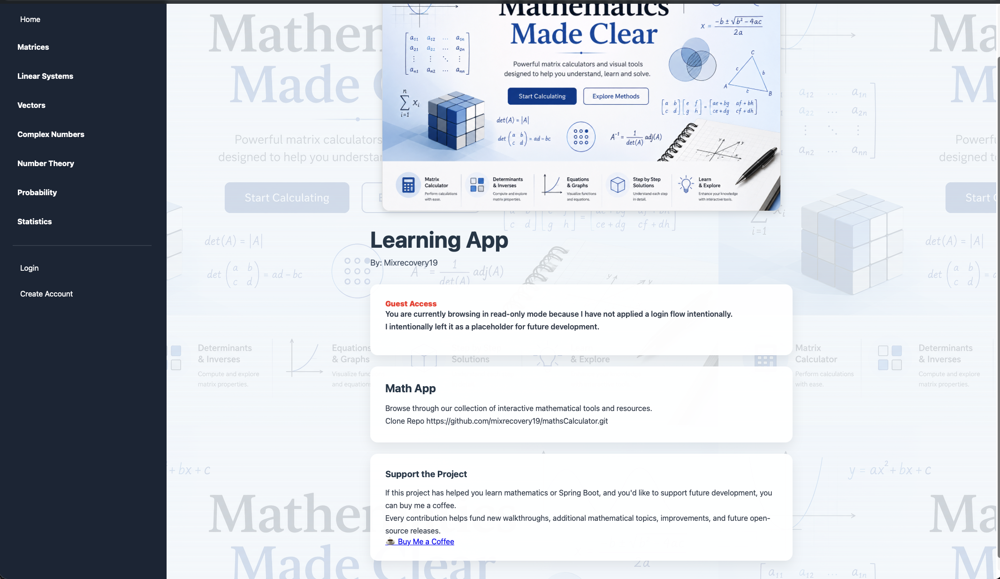
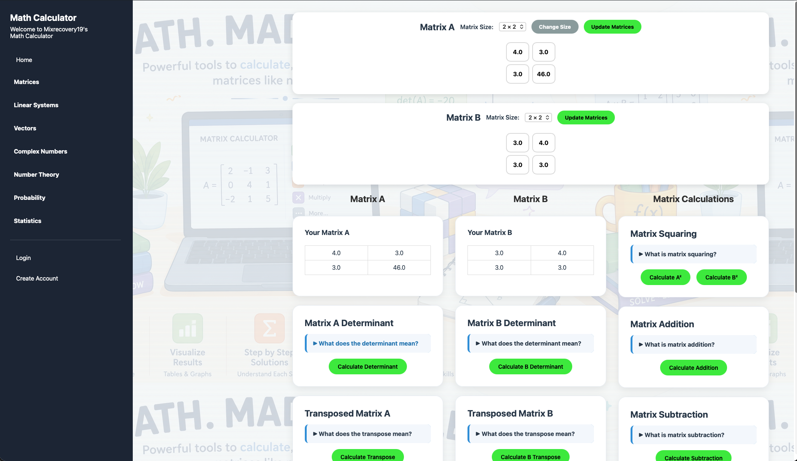
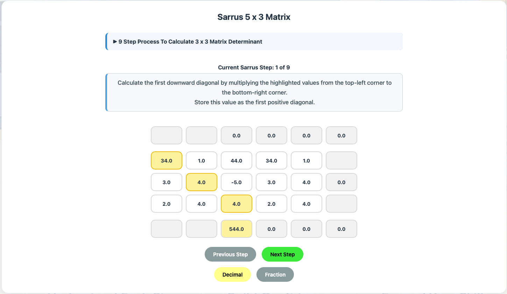
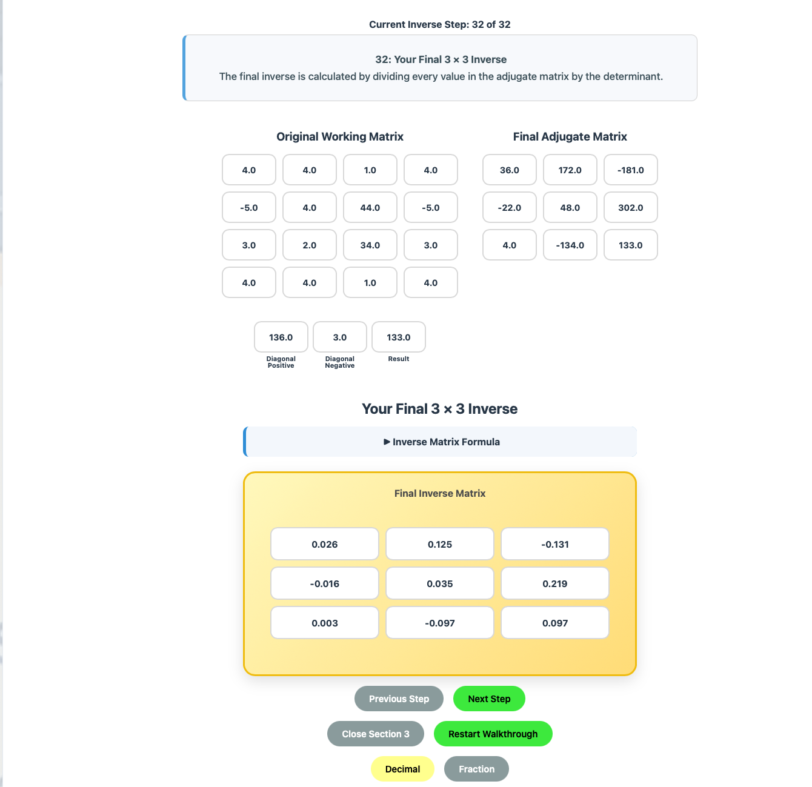
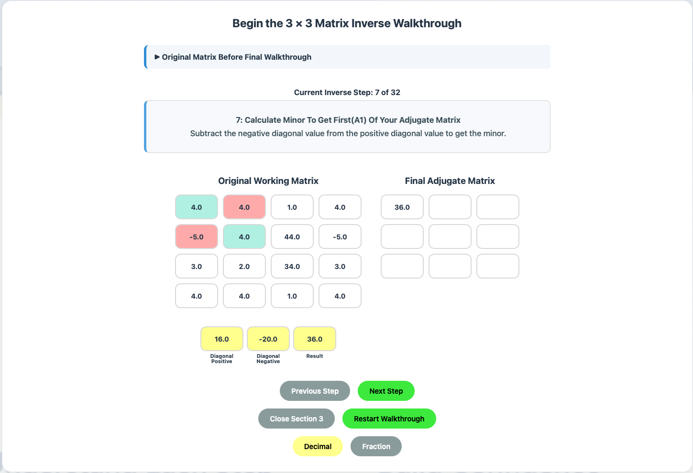
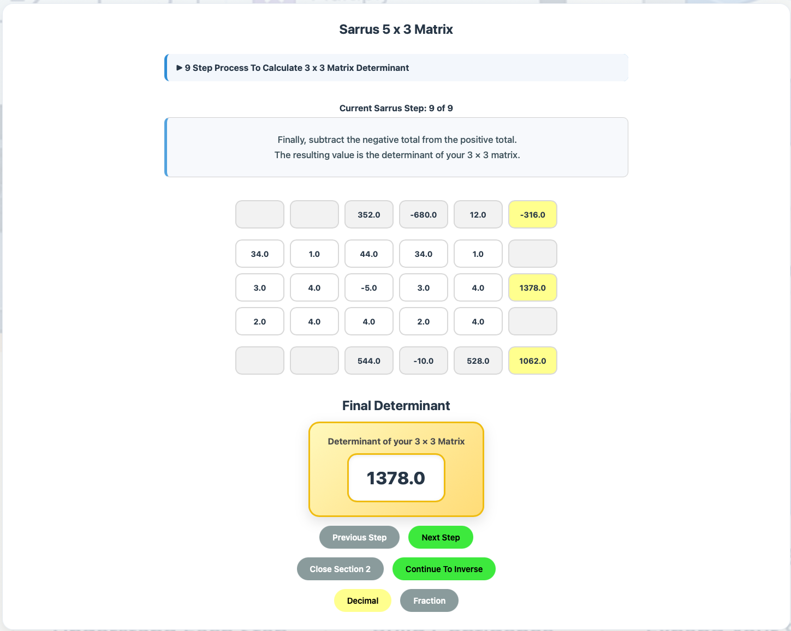

# Maths Calculator

Thank you for taking the time to check out my Maths Calculator.

Website: [www.cellfit.com.au](https://www.cellfit.com.au)

I am a Bachelor of Information Technology student, and after completing my first semester I wanted to reinforce the mathematics I learned in BIT112 – Mathematics for I.T. by combining it with the Object-Oriented Programming concepts I was learning in Java and Spring Boot.

Rather than creating a calculator that simply displays the answer, my goal has been to build interactive, step-by-step walkthroughs that mirror the way you would solve problems with pen and paper during exams and assignments. I hope this approach helps make the mathematics easier to understand and remember.

Artificial Intelligence is an incredible tool, but I also believe it is important to understand the underlying concepts rather than relying on AI to produce the answers. Developing that understanding is what helps turn good students into great students.

I hope you find this project useful. If it has helped you in your studies and you would like to support its continued development, I would be incredibly grateful.

☕ Buy me a coffee: [buymeacoffee.com/cellfit](https://buymeacoffee.com/cellfit)

Thank you for your support, and happy learning!

— Michael Kalaf

Some screenshots to give you an idea of some of what comes with this repo(which I hope to make my first, true, open source project in time)
## Screenshots

### Home

### Matrix Calculator

### Sarrus Method

### 3 × 3 Matrix Inverse

### Matrix Inverse Walkthrough

### Sarrus Determinant

